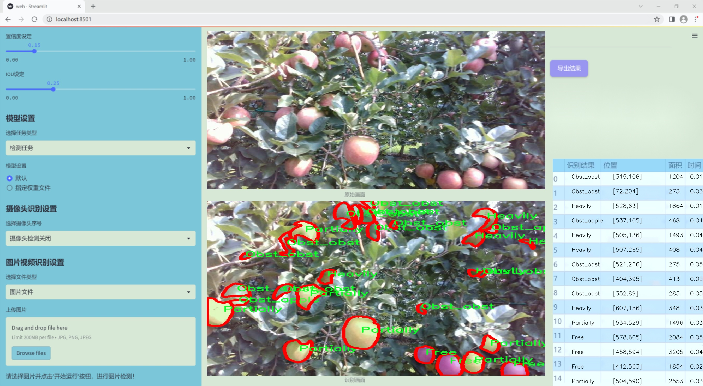
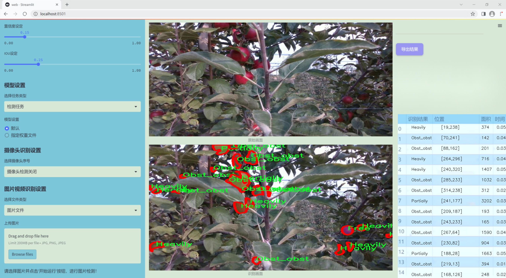
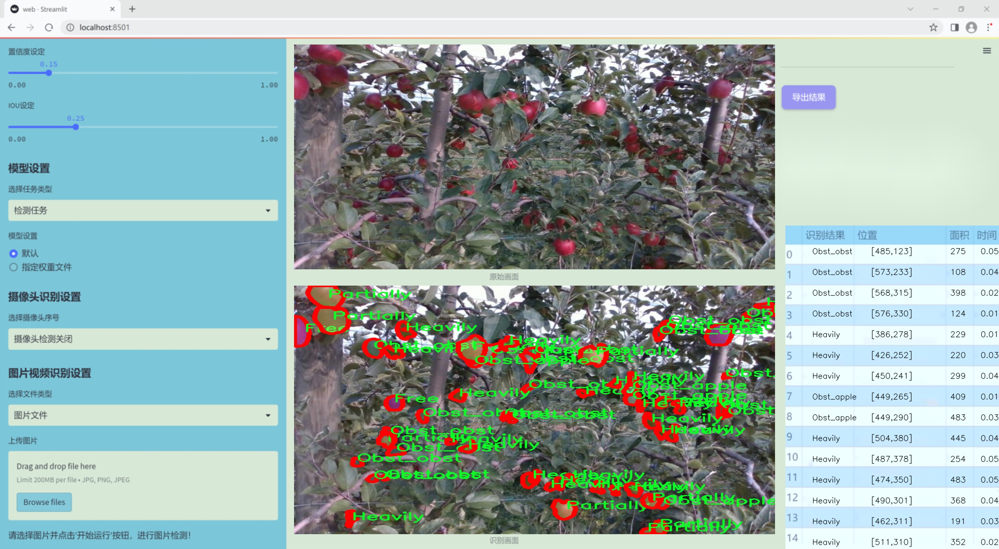
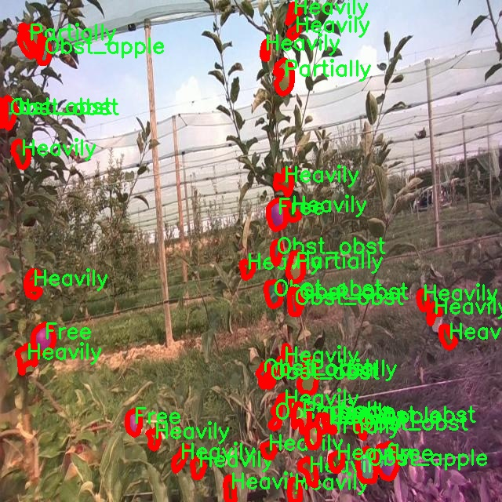
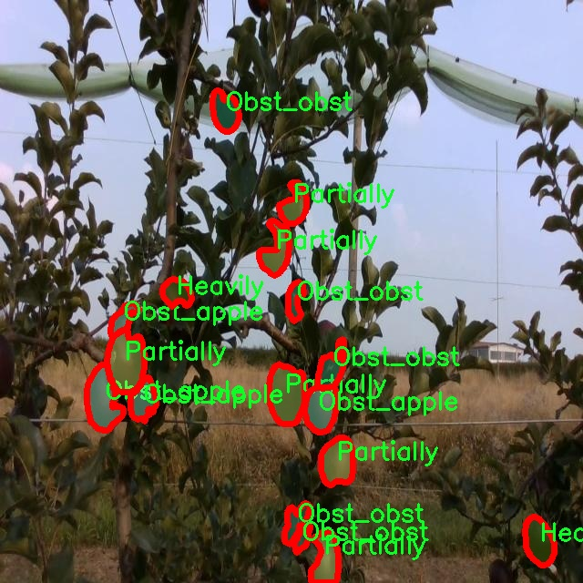
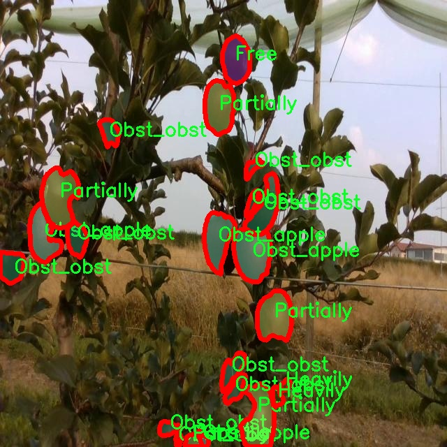
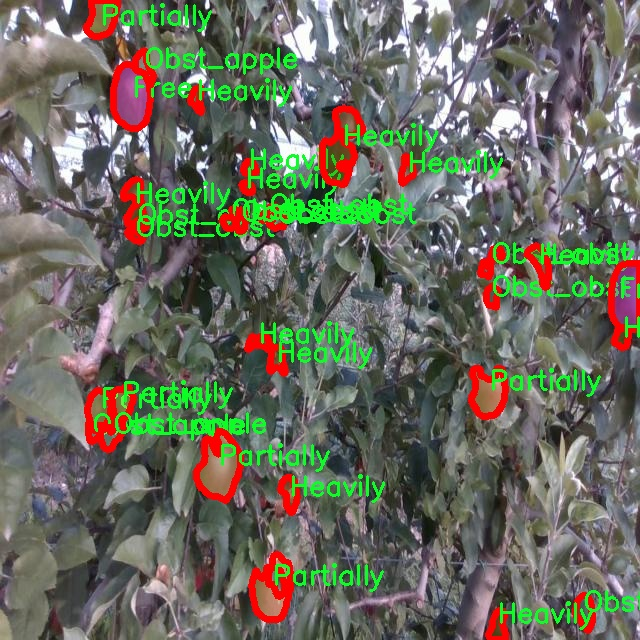
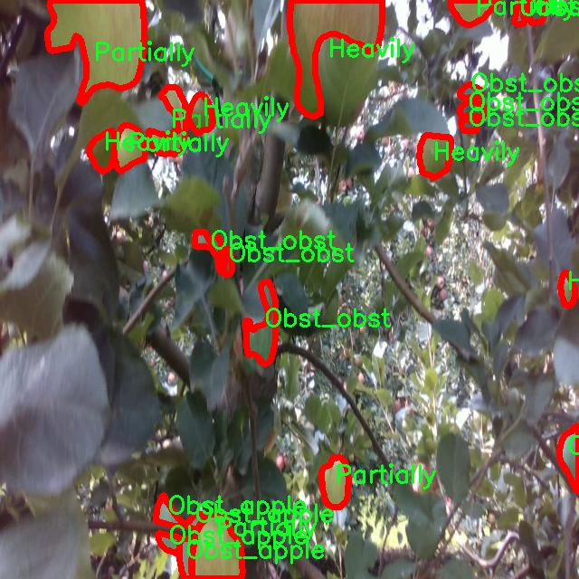

### 1.背景意义

研究背景与意义

随着农业现代化的推进，果品的质量和产量成为了研究的重点。苹果作为全球重要的水果之一，其种植和管理对农业经济具有重要影响。然而，苹果在生长过程中常常受到多种因素的影响，包括病虫害、气候变化以及管理不当等，这些因素可能导致果实的损失和品质下降。因此，开发一种高效的苹果实例分割检测系统，不仅能够提高果园管理的智能化水平，还能为果农提供科学的决策依据。

近年来，计算机视觉技术的快速发展为农业领域带来了新的机遇。尤其是实例分割技术的进步，使得我们能够对果园中的苹果进行精确的检测和分类。YOLO（You Only Look Once）系列模型因其高效的实时检测能力而受到广泛关注。YOLOv11作为该系列的最新版本，具备更强的特征提取能力和更高的检测精度，适合用于复杂环境下的实例分割任务。

本研究旨在基于改进的YOLOv11模型，构建一个针对苹果的实例分割检测系统。我们使用的“apple multiclass inst_seg”数据集包含1100张经过精细标注的苹果图像，涵盖了五个类别：Free、Heavily、Obst_apple、Obst_obst和Partially。这些类别的设置不仅反映了苹果的生长状态，也为模型的训练提供了丰富的样本。通过对这些图像的分析和处理，我们期望能够提升模型在不同环境下的适应性和准确性。

此外，本研究的成果将为果农提供一种高效的工具，帮助他们实时监测果园的健康状况，及时发现潜在问题，从而采取相应的管理措施。通过实现智能化的果园管理，不仅可以提高苹果的产量和质量，还能推动农业的可持续发展。因此，基于改进YOLOv11的苹果实例分割检测系统的研究具有重要的理论价值和实际意义。

### 2.视频效果

[2.1 视频效果](https://www.bilibili.com/video/BV1t8qVYnEb9/)

### 3.图片效果







##### [项目涉及的源码数据来源链接](https://kdocs.cn/l/cszuIiCKVNis)**

注意：本项目提供训练的数据集和训练教程,由于版本持续更新,暂不提供权重文件（best.pt）,请按照6.训练教程进行训练后实现上图演示的效果。

### 4.数据集信息

##### 4.1 本项目数据集类别数＆类别名

nc: 5
names: ['Free', 'Heavily', 'Obst_apple', 'Obst_obst', 'Partially']


该项目为【图像分割】数据集，请在【训练教程和Web端加载模型教程（第三步）】这一步的时候按照【图像分割】部分的教程来训练

##### 4.2 本项目数据集信息介绍

本项目数据集信息介绍

本项目所使用的数据集旨在支持改进YOLOv11的苹果实例分割检测系统，专注于“apple multiclass inst_seg”这一主题。该数据集包含五个主要类别，分别为“Free”、“Heavily”、“Obst_apple”、“Obst_obst”和“Partially”。这些类别涵盖了苹果在不同生长阶段和不同环境条件下的状态，能够为模型提供丰富的训练样本，提升其在实际应用中的检测能力。

在数据集的构建过程中，我们特别注重样本的多样性和代表性，以确保模型能够在各种情况下进行有效的实例分割。类别“Free”代表无障碍的苹果，适用于检测健康生长的果实；“Heavily”则指代果实生长繁茂的情况，可能存在过度拥挤的现象；“Obst_apple”类别则标识那些被其他苹果遮挡的果实，挑战模型在复杂场景中的识别能力；“Obst_obst”则涉及到苹果被其他物体（如树叶、枝条等）遮挡的情况，进一步增加了检测的难度；最后，“Partially”类别则描述了部分可见的苹果，要求模型能够推断出被遮挡部分的存在。

通过对这些类别的细致划分，我们希望能够提升YOLOv11在苹果实例分割任务中的准确性和鲁棒性。数据集的多样性不仅有助于训练模型识别不同状态的苹果，还能提高其在实际农业场景中的应用潜力，促进智能农业的发展。随着数据集的不断扩展和优化，我们期待能够为农业领域提供更为精准的技术支持，助力果农提高产量和质量。











### 5.全套项目环境部署视频教程（零基础手把手教学）

[5.1 所需软件PyCharm和Anaconda安装教程（第一步）](https://www.bilibili.com/video/BV1BoC1YCEKi/?spm_id_from=333.999.0.0&vd_source=bc9aec86d164b67a7004b996143742dc)


[5.2 安装Python虚拟环境创建和依赖库安装视频教程（第二步）](https://www.bilibili.com/video/BV1ZoC1YCEBw?spm_id_from=333.788.videopod.sections&vd_source=bc9aec86d164b67a7004b996143742dc)

### 6.改进YOLOv11训练教程和Web_UI前端加载模型教程（零基础手把手教学）

[6.1 改进YOLOv11训练教程和Web_UI前端加载模型教程（第三步）](https://www.bilibili.com/video/BV1BoC1YCEhR?spm_id_from=333.788.videopod.sections&vd_source=bc9aec86d164b67a7004b996143742dc)


按照上面的训练视频教程链接加载项目提供的数据集，运行train.py即可开始训练



     Epoch   gpu_mem       box       obj       cls    labels  img_size
     1/200     20.8G   0.01576   0.01955  0.007536        22      1280: 100%|██████████| 849/849 [14:42<00:00,  1.04s/it]
               Class     Images     Labels          P          R     mAP@.5 mAP@.5:.95: 100%|██████████| 213/213 [01:14<00:00,  2.87it/s]
                 all       3395      17314      0.994      0.957      0.0957      0.0843

     Epoch   gpu_mem       box       obj       cls    labels  img_size
     2/200     20.8G   0.01578   0.01923  0.007006        22      1280: 100%|██████████| 849/849 [14:44<00:00,  1.04s/it]
               Class     Images     Labels          P          R     mAP@.5 mAP@.5:.95: 100%|██████████| 213/213 [01:12<00:00,  2.95it/s]
                 all       3395      17314      0.996      0.956      0.0957      0.0845

     Epoch   gpu_mem       box       obj       cls    labels  img_size
     3/200     20.8G   0.01561    0.0191  0.006895        27      1280: 100%|██████████| 849/849 [10:56<00:00,  1.29it/s]
               Class     Images     Labels          P          R     mAP@.5 mAP@.5:.95: 100%|███████   | 187/213 [00:52<00:00,  4.04it/s]
                 all       3395      17314      0.996      0.957      0.0957      0.0845


###### [项目数据集下载链接](https://kdocs.cn/l/cszuIiCKVNis)

### 7.原始YOLOv11算法讲解


##### YOLOv11三大损失函数

YOLOv11（You Only Look Once）是一种流行的目标检测算法，其损失函数设计用于同时优化分类和定位任务。YOLO的损失函数通常包括几个部分：
**分类损失、定位损失（边界框回归损失）和置信度损失** 。其中，

  1. box_loss（边界框回归损失）是用于优化预测边界框与真实边界框之间的差异的部分。

  2. cls_loss（分类损失）是用于优化模型对目标类别的预测准确性的部分。分类损失确保模型能够正确地识别出图像中的对象属于哪个类别。

  3. dfl_loss（Distribution Focal Loss）是YOLO系列中的一种损失函数，特别是在一些改进版本如YOLOv5和YOLOv7中被引入。它的主要目的是解决目标检测中的类别不平衡问题，并提高模型在处理小目标和困难样本时的性能。

##### 边界框回归损失详解

box_loss（边界框回归损失）是用于优化预测边界框与真实边界框之间的差异的部分。


##### box_loss 的具体意义


##### 为什么需要 box_loss

  * 精确定位：通过最小化中心点坐标损失和宽高损失，模型能够更准确地预测目标的位置和大小。
  * 平衡不同类型的目标：使用平方根来处理宽高损失，可以更好地平衡不同大小的目标，确保小目标也能得到足够的关注。
  * 稳定训练：适当的损失函数设计有助于模型的稳定训练，避免梯度爆炸或消失等问题。

##### 分类损失详解

在YOLO（You Only Look
Once）目标检测算法中，cls_loss（分类损失）是用于优化模型对目标类别的预测准确性的部分。分类损失确保模型能够正确地识别出图像中的对象属于哪个类别。下面是关于cls_loss的详细解读：

##### 分类损失 (cls_loss) 的具体意义

  
分类损失通常使用交叉熵损失（Cross-Entropy
Loss）来计算。交叉熵损失衡量的是模型预测的概率分布与真实标签之间的差异。在YOLO中，分类损失的具体形式如下：


##### 为什么需要 cls_loss

  * 类别识别：cls_loss 确保模型能够正确识别出图像中的目标属于哪个类别。这对于目标检测任务至关重要，因为不仅需要知道目标的位置，还需要知道目标的类型。

  * 多类别支持：通过最小化分类损失，模型可以处理多个类别的目标检测任务。例如，在道路缺陷检测中，可能需要识别裂缝、坑洞、路面破损等多种类型的缺陷。

  * 提高准确性：分类损失有助于提高模型的分类准确性，从而提升整体检测性能。通过优化分类损失，模型可以更好地学习不同类别之间的特征差异。

##### 分布损失详解

`dfl_loss`（Distribution Focal
Loss）是YOLO系列中的一种损失函数，特别是在一些改进版本如YOLOv5和YOLOv7中被引入。它的主要目的是解决目标检测中的类别不平衡问题，并提高模型在处理小目标和困难样本时的性能。下面是对`dfl_loss`的详细解读：

##### DFL Loss 的背景

在目标检测任务中，类别不平衡是一个常见的问题。某些类别的样本数量可能远远多于其他类别，这会导致模型在训练过程中对常见类别的学习效果较好，而对罕见类别的学习效果较差。此外，小目标和困难样本的检测也是一个挑战，因为这些目标通常具有较少的特征信息，容易被忽略或误分类。

为了应对这些问题，研究者们提出了多种改进方法，其中之一就是`dfl_loss`。`dfl_loss`通过引入分布焦点损失来增强模型对困难样本的关注，并改善类别不平衡问题。

##### DFL Loss 的定义

DFL Loss
通常与传统的交叉熵损失结合使用，以增强模型对困难样本的学习能力。其核心思想是通过对每个类别的预测概率进行加权，使得模型更加关注那些难以正确分类的样本。

DFL Loss 的公式可以表示为：


##### DFL Loss 的具体意义**

  * **类别不平衡：** 通过引入平衡因子 α，DFL Loss 可以更好地处理类别不平衡问题。对于少数类别的样本，可以通过增加其权重来提升其重要性，从而提高模型对这些类别的检测性能。
  *  **困难样本：** 通过聚焦参数 γ，DFL Loss 可以让模型更加关注那些难以正确分类的样本。当 
  * γ 较大时，模型会对那些预测概率较低的样本给予更多的关注，从而提高这些样本的分类准确性。
  *  **提高整体性能** ：DFL Loss 结合了传统交叉熵损失的优势，并通过加权机制增强了模型对困难样本的学习能力，从而提高了整体的检测性能。


### 8.200+种全套改进YOLOV11创新点原理讲解

#### 8.1 200+种全套改进YOLOV11创新点原理讲解大全

由于篇幅限制，每个创新点的具体原理讲解就不全部展开，具体见下列网址中的改进模块对应项目的技术原理博客网址【Blog】（创新点均为模块化搭建，原理适配YOLOv5~YOLOv11等各种版本）

[改进模块技术原理博客【Blog】网址链接](https://gitee.com/qunmasj/good)


#### 8.2 精选部分改进YOLOV11创新点原理讲解

###### 这里节选部分改进创新点展开原理讲解(完整的改进原理见上图和[改进模块技术原理博客链接](https://gitee.com/qunmasj/good)【如果此小节的图加载失败可以通过CSDN或者Github搜索该博客的标题访问原始博客，原始博客图片显示正常】
### RepViT简介

近年来，与轻量级卷积神经网络(cnn)相比，轻量级视觉变压器(ViTs)在资源受限的移动设备上表现出了更高的性能和更低的延迟。这种改进通常归功于多头自注意模块，它使模型能够学习全局表示。然而，轻量级vit和轻量级cnn之间的架构差异还没有得到充分的研究。在这项研究中，我们重新审视了轻量级cnn的高效设计，并强调了它们在移动设备上的潜力。通过集成轻量级vit的高效架构选择，我们逐步增强了标准轻量级CNN的移动友好性，特别是MobileNetV3。这就产生了一个新的纯轻量级cnn家族，即RepViT。大量的实验表明，RepViT优于现有的轻型vit，并在各种视觉任务中表现出良好的延迟。在ImageNet上，RepViT在iPhone 12上以近1ms的延迟实现了超过80%的top-1精度，据我们所知，这是轻量级模型的第一次。

#### RepViT简介
轻量级模型研究一直是计算机视觉任务中的一个焦点，其目标是在降低计算成本的同时达到优秀的性能。轻量级模型与资源受限的移动设备尤其相关，使得视觉模型的边缘部署成为可能。在过去十年中，研究人员主要关注轻量级卷积神经网络（CNNs）的设计，提出了许多高效的设计原则，包括可分离卷积 、逆瓶颈结构 、通道打乱 和结构重参数化等，产生了 MobileNets ，ShuffleNets和 RepVGG 等代表性模型。

另一方面，视觉 Transformers（ViTs）成为学习视觉表征的另一种高效方案。与 CNNs 相比，ViTs 在各种计算机视觉任务中表现出了更优越的性能。然而，ViT 模型一般尺寸很大，延迟很高，不适合资源受限的移动设备。因此，研究人员开始探索 ViT 的轻量级设计。许多高效的ViTs设计原则被提出，大大提高了移动设备上 ViTs 的计算效率，产生了EfficientFormers ，MobileViTs等代表性模型。这些轻量级 ViTs 在移动设备上展现出了相比 CNNs 的更强的性能和更低的延迟。

轻量级 ViTs 优于轻量级 CNNs 的原因通常归结于多头注意力模块，该模块使模型能够学习全局表征。然而，轻量级 ViTs 和轻量级 CNNs 在块结构、宏观和微观架构设计方面存在值得注意的差异，但这些差异尚未得到充分研究。这自然引出了一个问题：轻量级 ViTs 的架构选择能否提高轻量级 CNN 的性能？在这项工作中，我们结合轻量级 ViTs 的架构选择，重新审视了轻量级 CNNs 的设计。我们的旨在缩小轻量级 CNNs 与轻量级 ViTs 之间的差距，并强调前者与后者相比在移动设备上的应用潜力。


在 ConvNeXt 中，参考该博客提出的基于 ResNet50 架构的基础上通过严谨的理论和实验分析，最终设计出一个非常优异的足以媲美 Swin-Transformer 的纯卷积神经网络架构。同样地，RepViT也是主要通过将轻量级 ViTs 的架构设计逐步整合到标准轻量级 CNN，即MobileNetV3-L，来对其进行针对性地改造（魔改）。在这个过程中，作者们考虑了不同粒度级别的设计元素，并通过一系列步骤达到优化的目标。


详细优化步骤如下：

#### 训练配方的对齐
论文中引入了一种衡量移动设备上延迟的指标，并将训练策略与现有的轻量级 ViTs 对齐。这一步骤主要是为了确保模型训练的一致性，其涉及两个概念，即延迟度量和训练策略的调整。

#### 延迟度量指标
为了更准确地衡量模型在真实移动设备上的性能，作者选择了直接测量模型在设备上的实际延迟，以此作为基准度量。这个度量方法不同于之前的研究，它们主要通过FLOPs或模型大小等指标优化模型的推理速度，这些指标并不总能很好地反映在移动应用中的实际延迟。

#### 训练策略的对齐
这里，将 MobileNetV3-L 的训练策略调整以与其他轻量级 ViTs 模型对齐。这包括使用 AdamW 优化器-ViTs 模型必备的优化器，进行 5 个 epoch 的预热训练，以及使用余弦退火学习率调度进行 300 个 epoch 的训练。尽管这种调整导致了模型准确率的略微下降，但可以保证公平性。

#### 块设计的优化
基于一致的训练设置，作者们探索了最优的块设计。块设计是 CNN 架构中的一个重要组成部分，优化块设计有助于提高网络的性能。

#### 分离 Token 混合器和通道混合器
这块主要是对 MobileNetV3-L 的块结构进行了改进，分离了令牌混合器和通道混合器。原来的 MobileNetV3 块结构包含一个 1x1 扩张卷积，然后是一个深度卷积和一个 1x1 的投影层，然后通过残差连接连接输入和输出。在此基础上，RepViT 将深度卷积提前，使得通道混合器和令牌混合器能够被分开。为了提高性能，还引入了结构重参数化来在训练时为深度滤波器引入多分支拓扑。最终，作者们成功地在 MobileNetV3 块中分离了令牌混合器和通道混合器，并将这种块命名为 RepViT 块。

#### 降低扩张比例并增加宽度
在通道混合器中，原本的扩张比例是 4，这意味着 MLP 块的隐藏维度是输入维度的四倍，消耗了大量的计算资源，对推理时间有很大的影响。为了缓解这个问题，我们可以将扩张比例降低到 2，从而减少了参数冗余和延迟，使得 MobileNetV3-L 的延迟降低到 0.65ms。随后，通过增加网络的宽度，即增加各阶段的通道数量，Top-1 准确率提高到 73.5%，而延迟只增加到 0.89ms！

#### 宏观架构元素的优化
在这一步，本文进一步优化了MobileNetV3-L在移动设备上的性能，主要是从宏观架构元素出发，包括 stem，降采样层，分类器以及整体阶段比例。通过优化这些宏观架构元素，模型的性能可以得到显著提高。

#### 浅层网络使用卷积提取器
ViTs 通常使用一个将输入图像分割成非重叠补丁的 “patchify” 操作作为 stem。然而，这种方法在训练优化性和对训练配方的敏感性上存在问题。因此，作者们采用了早期卷积来代替，这种方法已经被许多轻量级 ViTs 所采纳。对比之下，MobileNetV3-L 使用了一个更复杂的 stem 进行 4x 下采样。这样一来，虽然滤波器的初始数量增加到24，但总的延迟降低到0.86ms，同时 top-1 准确率提高到 73.9%。

#### 更深的下采样层
在 ViTs 中，空间下采样通常通过一个单独的补丁合并层来实现。因此这里我们可以采用一个单独和更深的下采样层，以增加网络深度并减少由于分辨率降低带来的信息损失。具体地，作者们首先使用一个 1x1 卷积来调整通道维度，然后将两个 1x1 卷积的输入和输出通过残差连接，形成一个前馈网络。此外，他们还在前面增加了一个 RepViT 块以进一步加深下采样层，这一步提高了 top-1 准确率到 75.4%，同时延迟为 0.96ms。

#### 更简单的分类器
在轻量级 ViTs 中，分类器通常由一个全局平均池化层后跟一个线性层组成。相比之下，MobileNetV3-L 使用了一个更复杂的分类器。因为现在最后的阶段有更多的通道，所以作者们将它替换为一个简单的分类器，即一个全局平均池化层和一个线性层，这一步将延迟降低到 0.77ms，同时 top-1 准确率为 74.8%。

#### 整体阶段比例
阶段比例代表了不同阶段中块数量的比例，从而表示了计算在各阶段中的分布。论文选择了一个更优的阶段比例 1:1:7:1，然后增加网络深度到 2:2:14:2，从而实现了一个更深的布局。这一步将 top-1 准确率提高到 76.9%，同时延迟为 1.02 ms。

#### 卷积核大小的选择
众所周知，CNNs 的性能和延迟通常受到卷积核大小的影响。例如，为了建模像 MHSA 这样的远距离上下文依赖，ConvNeXt 使用了大卷积核，从而实现了显著的性能提升。然而，大卷积核对于移动设备并不友好，因为它的计算复杂性和内存访问成本。MobileNetV3-L 主要使用 3x3 的卷积，有一部分块中使用 5x5 的卷积。作者们将它们替换为3x3的卷积，这导致延迟降低到 1.00ms，同时保持了76.9%的top-1准确率。

#### SE 层的位置
自注意力模块相对于卷积的一个优点是根据输入调整权重的能力，这被称为数据驱动属性。作为一个通道注意力模块，SE层可以弥补卷积在缺乏数据驱动属性上的限制，从而带来更好的性能。MobileNetV3-L 在某些块中加入了SE层，主要集中在后两个阶段。然而，与分辨率较高的阶段相比，分辨率较低的阶段从SE提供的全局平均池化操作中获得的准确率提升较小。作者们设计了一种策略，在所有阶段以交叉块的方式使用SE层，从而在最小的延迟增量下最大化准确率的提升，这一步将top-1准确率提升到77.4%，同时延迟降低到0.87ms。

注意！【这一点其实百度在很早前就已经做过实验比对得到过这个结论了，SE 层放置在靠近深层的地方效果好】

#### 微观设计的调整
RepViT 通过逐层微观设计来调整轻量级 CNN，这包括选择合适的卷积核大小和优化挤压-激励（Squeeze-and-excitation，简称SE）层的位置。这两种方法都能显著改善模型性能。

#### 网络架构
最终，通过整合上述改进策略，我们便得到了模型RepViT的整体架构，该模型有多个变种，例如RepViT-M1/M2/M3。同样地，不同的变种主要通过每个阶段的通道数和块数来区分。


### 9.系统功能展示

图9.1.系统支持检测结果表格显示

  图9.2.系统支持置信度和IOU阈值手动调节

  图9.3.系统支持自定义加载权重文件best.pt(需要你通过步骤5中训练获得)

  图9.4.系统支持摄像头实时识别

  图9.5.系统支持图片识别

  图9.6.系统支持视频识别

  图9.7.系统支持识别结果文件自动保存

  图9.8.系统支持Excel导出检测结果数据


### 10. YOLOv11核心改进源码讲解

#### 10.1 pkinet.py

以下是经过精简和注释的核心代码部分，保留了主要的类和函数，并对其进行了详细的中文注释：

```python
import math
import torch
import torch.nn as nn
from typing import Optional, Union, Sequence

# 定义DropPath函数，用于随机丢弃路径（随机深度）
def drop_path(x: torch.Tensor, drop_prob: float = 0., training: bool = False) -> torch.Tensor:
    """在残差块的主路径中应用随机丢弃路径（随机深度）。
    
    Args:
        x (torch.Tensor): 输入张量。
        drop_prob (float): 路径被置零的概率。默认值为0。
        training (bool): 是否处于训练模式。
    
    Returns:
        torch.Tensor: 处理后的张量。
    """
    if drop_prob == 0. or not training:
        return x  # 如果不丢弃路径，直接返回输入
    keep_prob = 1 - drop_prob
    shape = (x.shape[0], ) + (1, ) * (x.ndim - 1)  # 处理不同维度的张量
    random_tensor = keep_prob + torch.rand(shape, dtype=x.dtype, device=x.device)
    output = x.div(keep_prob) * random_tensor.floor()  # 应用随机丢弃
    return output

# 定义DropPath类
class DropPath(nn.Module):
    """随机丢弃路径（随机深度）模块。"""
    def __init__(self, drop_prob: float = 0.1):
        super().__init__()
        self.drop_prob = drop_prob  # 丢弃概率

    def forward(self, x: torch.Tensor) -> torch.Tensor:
        return drop_path(x, self.drop_prob, self.training)  # 前向传播

# 定义ConvFFN类，使用卷积模块实现多层感知机
class ConvFFN(nn.Module):
    """使用卷积模块实现的多层感知机。"""
    def __init__(self, in_channels: int, out_channels: Optional[int] = None, hidden_channels_scale: float = 4.0):
        super().__init__()
        out_channels = out_channels or in_channels
        hidden_channels = int(in_channels * hidden_channels_scale)

        # 定义前向传播的层
        self.ffn_layers = nn.Sequential(
            nn.Conv2d(in_channels, hidden_channels, kernel_size=1),  # 1x1卷积
            nn.Conv2d(hidden_channels, hidden_channels, kernel_size=3, padding=1, groups=hidden_channels),  # 深度卷积
            nn.GELU(),  # 激活函数
            nn.Conv2d(hidden_channels, out_channels, kernel_size=1)  # 1x1卷积
        )

    def forward(self, x):
        return self.ffn_layers(x)  # 前向传播

# 定义PKIBlock类，聚合多个卷积模块和FFN
class PKIBlock(nn.Module):
    """聚合多个卷积模块和FFN的块。"""
    def __init__(self, in_channels: int, out_channels: Optional[int] = None):
        super().__init__()
        self.block = ConvFFN(in_channels, out_channels)  # 使用ConvFFN
        self.drop_path = DropPath(0.1)  # 使用DropPath

    def forward(self, x):
        return self.drop_path(self.block(x)) + x  # 残差连接

# 定义PKINet类，构建整个网络结构
class PKINet(nn.Module):
    """Poly Kernel Inception Network。"""
    def __init__(self, arch: str = 'S'):
        super().__init__()
        self.stages = nn.ModuleList()  # 存储网络的各个阶段
        self.stages.append(PKIBlock(3, 32))  # 添加初始块
        # 添加更多的PKIBlock到网络中
        for _ in range(3):  # 示例添加3个块
            self.stages.append(PKIBlock(32, 64))

    def forward(self, x):
        for stage in self.stages:
            x = stage(x)  # 前向传播
        return x

# 定义网络的实例化函数
def PKINET_S():
    return PKINet('S')  # 返回S版本的PKINet

if __name__ == '__main__':
    model = PKINET_S()  # 实例化模型
    inputs = torch.randn((1, 3, 640, 640))  # 创建输入张量
    res = model(inputs)  # 前向传播
    print(res.size())  # 输出结果的尺寸
```

### 代码核心部分说明：
1. **DropPath**: 实现了随机丢弃路径的功能，适用于残差网络中，帮助减少过拟合。
2. **ConvFFN**: 实现了一个多层感知机（MLP），通过卷积层来处理输入数据。
3. **PKIBlock**: 组合多个卷积模块和FFN，形成一个基本的网络块，支持残差连接。
4. **PKINet**: 整个网络的结构，包含多个PKIBlock，形成完整的网络架构。

以上代码保留了核心的功能模块，并对每个部分进行了详细的中文注释，以便于理解其功能和实现方式。

这个文件是一个用于构建多核Inception网络（PKINet）的PyTorch实现。它包含了多个模块和类，用于构建网络的不同部分。首先，文件导入了一些必要的库，包括数学库、PyTorch库和一些深度学习相关的模块。

文件中定义了一些辅助函数，例如`drop_path`和`make_divisible`。`drop_path`函数实现了随机深度（Stochastic Depth）技术，用于在训练过程中随机丢弃某些路径，以增强模型的泛化能力。`make_divisible`函数用于确保通道数是某个值的倍数，以便在模型的不同层之间保持一致性。

接下来，文件定义了一些基础模块，例如`DropPath`、`BCHW2BHWC`、`BHWC2BCHW`、`GSiLU`等。这些模块在网络的构建中起到基础作用。`DropPath`模块用于实现随机深度，`BCHW2BHWC`和`BHWC2BCHW`模块用于在不同的张量维度之间转换，`GSiLU`模块实现了一种激活函数。

`CAA`类实现了上下文锚注意力机制，用于增强特征的表达能力。`ConvFFN`类实现了一个多层感知机（MLP），使用卷积模块来进行特征转换。`Stem`和`DownSamplingLayer`类则用于网络的初始层和下采样层。

`InceptionBottleneck`类实现了Inception模块的瓶颈结构，它包含多个卷积层和注意力机制，以提取多尺度特征。`PKIBlock`类是多核Inception块的实现，结合了Inception模块和前馈网络。`PKIStage`类则是将多个`PKIBlock`组合在一起，形成网络的一个阶段。

最后，`PKINet`类是整个网络的实现，它根据不同的架构设置（如'T'、'S'、'B'）构建网络。该类的构造函数初始化了网络的各个阶段，并根据输入的图像大小自动调整通道数。`forward`方法定义了网络的前向传播过程，`init_weights`方法用于初始化网络的权重。

在文件的最后部分，定义了三个函数`PKINET_T`、`PKINET_S`和`PKINET_B`，用于创建不同架构的PKINet模型。在`__main__`部分，创建了一个PKINET_T模型，并对随机生成的输入进行前向传播，输出每个阶段的特征图大小。

总体来说，这个文件实现了一个复杂的深度学习模型，旨在通过多核Inception结构来提高图像处理任务的性能。

#### 10.2 kernel_warehouse.py

以下是经过简化和注释的核心代码部分：

```python
import torch
import torch.nn as nn
import torch.nn.functional as F

class Attention(nn.Module):
    def __init__(self, in_planes, reduction, num_static_cell, num_local_mixture, norm_layer=nn.BatchNorm1d):
        super(Attention, self).__init__()
        # 计算隐藏层的通道数
        hidden_planes = max(int(in_planes * reduction), 16)
        self.kw_planes_per_mixture = num_static_cell + 1  # 每个混合物的通道数
        self.num_local_mixture = num_local_mixture  # 本地混合物的数量
        self.kw_planes = self.kw_planes_per_mixture * num_local_mixture  # 总的通道数

        # 定义网络层
        self.avgpool = nn.AdaptiveAvgPool1d(1)  # 自适应平均池化
        self.fc1 = nn.Linear(in_planes, hidden_planes)  # 全连接层1
        self.norm1 = norm_layer(hidden_planes)  # 归一化层
        self.act1 = nn.ReLU(inplace=True)  # 激活函数

        # 初始化权重
        self._initialize_weights()

    def _initialize_weights(self):
        # 权重初始化
        for m in self.modules():
            if isinstance(m, nn.Linear):
                nn.init.kaiming_normal_(m.weight, mode='fan_out', nonlinearity='relu')
                if m.bias is not None:
                    nn.init.constant_(m.bias, 0)
            if isinstance(m, nn.BatchNorm1d):
                nn.init.constant_(m.weight, 1)
                nn.init.constant_(m.bias, 0)

    def forward(self, x):
        # 前向传播
        x = self.avgpool(x.reshape(*x.shape[:2], -1)).squeeze(dim=-1)  # 池化
        x = self.act1(self.norm1(self.fc1(x)))  # 线性变换 + 归一化 + 激活
        return x  # 返回结果

class KWconvNd(nn.Module):
    def __init__(self, in_planes, out_planes, kernel_size, stride=1, padding=0, dilation=1, groups=1, bias=False):
        super(KWconvNd, self).__init__()
        self.in_planes = in_planes  # 输入通道数
        self.out_planes = out_planes  # 输出通道数
        self.kernel_size = kernel_size  # 卷积核大小
        self.stride = stride  # 步幅
        self.padding = padding  # 填充
        self.dilation = dilation  # 膨胀
        self.groups = groups  # 分组卷积
        self.bias = nn.Parameter(torch.zeros([self.out_planes]), requires_grad=True).float() if bias else None  # 偏置

    def forward(self, x):
        # 前向传播逻辑
        # 这里可以添加卷积操作的实现
        return x  # 返回结果

class KWConv1d(KWconvNd):
    # 1D卷积层
    def __init__(self, in_planes, out_planes, kernel_size, stride=1, padding=0, dilation=1, groups=1, bias=False):
        super(KWConv1d, self).__init__(in_planes, out_planes, kernel_size, stride, padding, dilation, groups, bias)

    def forward(self, x):
        # 1D卷积前向传播
        return super().forward(x)  # 调用父类的前向传播

class Warehouse_Manager(nn.Module):
    def __init__(self, reduction=0.0625):
        super(Warehouse_Manager, self).__init__()
        self.reduction = reduction  # 降维比例
        self.warehouse_list = {}  # 存储卷积层的信息

    def reserve(self, in_planes, out_planes, kernel_size=1, stride=1, padding=0, dilation=1, groups=1, bias=True, warehouse_name='default'):
        # 创建卷积层并记录其信息
        weight_shape = [out_planes, in_planes // groups, kernel_size]  # 权重形状
        if warehouse_name not in self.warehouse_list:
            self.warehouse_list[warehouse_name] = []
        self.warehouse_list[warehouse_name].append(weight_shape)  # 记录权重形状
        return KWConv1d(in_planes, out_planes, kernel_size, stride, padding, dilation, groups, bias)  # 返回卷积层

    def store(self):
        # 存储卷积层的权重
        for warehouse_name, shapes in self.warehouse_list.items():
            # 处理每个仓库的权重
            pass  # 这里可以添加权重存储的逻辑

# 其他类和函数省略...
```

### 代码说明：
1. **Attention类**：实现了一个注意力机制，包含了初始化、权重初始化和前向传播的方法。
2. **KWconvNd类**：是一个基础的卷积层类，包含了输入输出通道、卷积核大小、步幅、填充等参数。
3. **KWConv1d类**：继承自KWconvNd，专门用于1D卷积操作。
4. **Warehouse_Manager类**：管理卷积层的仓库，能够记录卷积层的信息并创建相应的卷积层。

这些核心部分构成了一个具有注意力机制的卷积神经网络的基础，能够进行动态的卷积层管理和权重存储。

这个程序文件 `kernel_warehouse.py` 是一个实现了核仓库（Kernel Warehouse）管理和相关卷积操作的 PyTorch 模块。它主要包含了多个类和函数，用于定义和管理卷积层的权重，并通过注意力机制动态选择和使用这些权重。

首先，文件导入了必要的 PyTorch 库以及一些工具函数和模块。`parse` 函数用于解析输入参数，如果输入是可迭代的，它会根据需要返回一个重复的列表。

接下来，定义了一个 `Attention` 类，该类继承自 `nn.Module`，用于实现注意力机制。它的构造函数中初始化了一些参数，包括输入通道数、降维比例、静态单元数、局部混合数等。`Attention` 类还包含了权重初始化、温度更新和前向传播等方法。前向传播过程中，它会对输入进行池化、线性变换、归一化和激活，然后根据注意力机制生成权重。

`KWconvNd` 类是一个通用的卷积层类，支持不同维度的卷积操作。它的构造函数接收输入和输出通道数、卷积核大小、步幅、填充、扩张等参数，并根据这些参数解析成适合的格式。`init_attention` 方法用于初始化注意力机制，而 `forward` 方法则实现了卷积操作的前向传播。

接下来，`KWConv1d`、`KWConv2d` 和 `KWConv3d` 类分别继承自 `KWconvNd`，用于实现一维、二维和三维卷积操作。它们定义了各自的维度和相应的卷积函数。

`KWLinear` 类是一个线性层的实现，内部使用 `KWConv1d` 来完成线性变换。

`Warehouse_Manager` 类是核心部分，它管理卷积层的权重仓库。它的构造函数接收多个参数，包括降维比例、单元数比例、共享范围等。`reserve` 方法用于创建动态卷积层并记录其信息，而 `store` 方法则负责存储权重并计算相关参数。`allocate` 方法用于将权重分配给网络中的卷积层。

最后，`KWConv` 类结合了卷积操作和批归一化，并在前向传播中依次执行卷积、归一化和激活操作。

文件还包含一个 `get_temperature` 函数，用于根据当前迭代次数和总迭代次数计算温度值，这在训练过程中可能用于调整模型的学习策略。

整体来看，这个文件实现了一个灵活的卷积层管理系统，通过注意力机制和仓库管理策略来优化卷积操作的权重使用，适用于深度学习模型的构建和训练。

#### 10.3 head.py

以下是代码中最核心的部分，包含了YOLOv8的检测头实现，并对其进行了详细的中文注释：

```python
import torch
import torch.nn as nn
import torch.nn.functional as F
from ..modules import Conv, DFL, make_anchors, dist2bbox

class Detect_DyHead(nn.Module):
    """YOLOv8检测头，使用动态头进行目标检测。"""
    
    def __init__(self, nc=80, hidc=256, block_num=2, ch=()):
        """
        初始化检测头。

        参数：
        nc (int): 类别数量。
        hidc (int): 隐藏层通道数。
        block_num (int): 动态头块的数量。
        ch (tuple): 输入通道数。
        """
        super().__init__()
        self.nc = nc  # 类别数量
        self.nl = len(ch)  # 检测层的数量
        self.reg_max = 16  # DFL通道数
        self.no = nc + self.reg_max * 4  # 每个锚点的输出数量
        self.stride = torch.zeros(self.nl)  # 构建时计算的步幅
        c2, c3 = max((16, ch[0] // 4, self.reg_max * 4)), max(ch[0], self.nc)  # 通道数

        # 定义卷积层
        self.conv = nn.ModuleList(nn.Sequential(Conv(x, hidc, 1)) for x in ch)
        self.dyhead = nn.Sequential(*[DyHeadBlock(hidc) for _ in range(block_num)])  # 动态头块
        self.cv2 = nn.ModuleList(
            nn.Sequential(Conv(hidc, c2, 3), Conv(c2, c2, 3), nn.Conv2d(c2, 4 * self.reg_max, 1)) for _ in ch
        )
        self.cv3 = nn.ModuleList(
            nn.Sequential(
                nn.Sequential(DWConv(hidc, x, 3), Conv(x, c3, 1)),
                nn.Sequential(DWConv(c3, c3, 3), Conv(c3, c3, 1)),
                nn.Conv2d(c3, self.nc, 1),
            )
            for x in ch
        )
        self.dfl = DFL(self.reg_max) if self.reg_max > 1 else nn.Identity()  # DFL层

    def forward(self, x):
        """前向传播，返回预测的边界框和类别概率。"""
        for i in range(self.nl):
            x[i] = self.conv[i](x[i])  # 通过卷积层处理输入
        x = self.dyhead(x)  # 通过动态头处理特征
        shape = x[0].shape  # 获取输出形状 BCHW

        for i in range(self.nl):
            # 将cv2和cv3的输出拼接
            x[i] = torch.cat((self.cv2[i](x[i]), self.cv3[i](x[i])), 1)

        if self.training:
            return x  # 训练模式下返回处理后的特征
        elif self.shape != shape:
            # 动态锚点生成
            self.anchors, self.strides = (x.transpose(0, 1) for x in make_anchors(x, self.stride, 0.5))
            self.shape = shape

        # 将所有输出拼接为一个张量
        x_cat = torch.cat([xi.view(shape[0], self.no, -1) for xi in x], 2)
        box, cls = x_cat.split((self.reg_max * 4, self.nc), 1)  # 分割边界框和类别概率
        dbox = dist2bbox(self.dfl(box), self.anchors.unsqueeze(0), xywh=True, dim=1) * self.strides  # 解码边界框
        y = torch.cat((dbox, cls.sigmoid()), 1)  # 返回边界框和经过sigmoid处理的类别概率
        return y

    def bias_init(self):
        """初始化检测头的偏置，要求步幅可用。"""
        for a, b, s in zip(self.cv2, self.cv3, self.stride):
            a[-1].bias.data[:] = 1.0  # 边界框偏置初始化为1
            b[-1].bias.data[:self.nc] = math.log(5 / self.nc / (640 / s) ** 2)  # 类别偏置初始化
```

### 代码核心部分说明：
1. **Detect_DyHead类**：这是YOLOv8的检测头实现，使用动态头（DyHead）来进行目标检测。
2. **初始化方法**：设置类别数量、通道数、卷积层、动态头块等参数。
3. **前向传播方法**：处理输入特征，通过卷积层和动态头进行特征提取，生成边界框和类别概率。
4. **偏置初始化方法**：用于初始化检测头的偏置，以提高模型的收敛速度。

以上代码是YOLOv8目标检测模型的核心部分，包含了模型的基本结构和前向传播逻辑。

这个文件 `head.py` 定义了多个用于目标检测和分割的模型头部，主要是基于 YOLOv8 的架构。文件中包含了多个类，每个类实现了不同的检测或分割功能，主要用于处理图像中的物体检测、关键点检测和分割任务。

首先，文件导入了一些必要的库，包括 PyTorch 和相关的神经网络模块。这些模块提供了构建深度学习模型所需的基本功能。

接下来，文件定义了多个检测头类。每个类通常会继承自 `nn.Module`，并实现以下主要功能：

1. **初始化方法 (`__init__`)**：在初始化中，定义了网络的结构，包括卷积层、激活函数、正则化层等。还设置了一些超参数，如类别数量、隐藏通道数、输出数量等。

2. **前向传播方法 (`forward`)**：这个方法定义了数据如何通过网络流动。输入的特征图经过卷积、激活和其他操作后，生成预测的边界框和类别概率。根据训练和推理模式，前向传播的逻辑可能会有所不同。

3. **锚框和步幅的计算**：在推理过程中，动态生成锚框和步幅，以适应输入特征图的形状。这些锚框用于后续的边界框解码。

4. **解码方法 (`decode_bboxes`)**：将网络输出的边界框参数转换为实际的边界框坐标。这一过程通常涉及到对输出进行逆变换，以便得到在原始图像上的位置。

5. **偏置初始化 (`bias_init`)**：初始化网络中的偏置项，以帮助模型更快地收敛。

文件中定义的类包括但不限于：
- `Detect_DyHead`：实现了动态头部的检测模型。
- `Detect_AFPN_P345` 和 `Detect_AFPN_P2345`：实现了基于自适应特征金字塔网络（AFPN）的检测模型。
- `Detect_Efficient`：实现了高效的检测头。
- `Detect_LSCD` 和 `Detect_LSCSBD`：实现了轻量级共享卷积检测头。
- `Detect_TADDH`：实现了任务动态对齐检测头。
- `Segment_Efficient`、`Segment_LSCD`、`Segment_LADH` 等：实现了不同的分割头，处理图像分割任务。

此外，文件还定义了一些用于特定任务的类，如 `Pose_LSCD` 和 `OBB_LSCD`，分别用于关键点检测和旋转边界框检测。

总体而言，这个文件是 YOLOv8 模型实现的一部分，提供了多种灵活的检测和分割头部，可以根据不同的任务需求进行选择和组合。每个类的设计都考虑到了模型的可扩展性和高效性，以便在实际应用中能够快速适应不同的场景和数据集。

#### 10.4 rep_block.py

以下是经过简化和注释的核心代码部分，主要集中在 `DiverseBranchBlock` 类及其相关函数上：

```python
import torch
import torch.nn as nn
import torch.nn.functional as F

def transI_fusebn(kernel, bn):
    """
    将卷积核和批归一化层的参数融合，返回融合后的卷积核和偏置。
    """
    gamma = bn.weight  # 获取批归一化的缩放因子
    std = (bn.running_var + bn.eps).sqrt()  # 计算标准差
    # 融合卷积核和批归一化参数
    return kernel * ((gamma / std).reshape(-1, 1, 1, 1)), bn.bias - bn.running_mean * gamma / std

def conv_bn(in_channels, out_channels, kernel_size, stride=1, padding=0, dilation=1, groups=1):
    """
    创建一个卷积层和批归一化层的组合。
    """
    conv_layer = nn.Conv2d(in_channels=in_channels, out_channels=out_channels, kernel_size=kernel_size,
                           stride=stride, padding=padding, dilation=dilation, groups=groups,
                           bias=False)  # 不使用偏置
    bn_layer = nn.BatchNorm2d(num_features=out_channels, affine=True)  # 批归一化层
    return nn.Sequential(conv_layer, bn_layer)  # 返回组合的层

class DiverseBranchBlock(nn.Module):
    def __init__(self, in_channels, out_channels, kernel_size, stride=1, padding=None, dilation=1, groups=1):
        """
        初始化DiverseBranchBlock，包含多个分支的卷积结构。
        """
        super(DiverseBranchBlock, self).__init__()
        self.kernel_size = kernel_size
        self.in_channels = in_channels
        self.out_channels = out_channels
        self.groups = groups
        
        if padding is None:
            padding = kernel_size // 2  # 默认填充为卷积核的一半

        # 原始卷积和批归一化
        self.dbb_origin = conv_bn(in_channels=in_channels, out_channels=out_channels, kernel_size=kernel_size,
                                  stride=stride, padding=padding, dilation=dilation, groups=groups)

        # 平均池化分支
        self.dbb_avg = nn.Sequential(
            nn.Conv2d(in_channels=in_channels, out_channels=out_channels, kernel_size=1, stride=1, padding=0, groups=groups, bias=False),
            nn.BatchNorm2d(out_channels),
            nn.AvgPool2d(kernel_size=kernel_size, stride=stride, padding=0)
        )

        # 1x1卷积分支
        self.dbb_1x1_kxk = nn.Sequential(
            nn.Conv2d(in_channels=in_channels, out_channels=out_channels, kernel_size=1, stride=stride, padding=0, groups=groups, bias=False),
            nn.BatchNorm2d(out_channels)
        )

    def forward(self, inputs):
        """
        前向传播，计算输出。
        """
        out = self.dbb_origin(inputs)  # 通过原始卷积分支
        out += self.dbb_avg(inputs)  # 加上平均池化分支
        out += self.dbb_1x1_kxk(inputs)  # 加上1x1卷积分支
        return out  # 返回最终输出

    def get_equivalent_kernel_bias(self):
        """
        获取等效的卷积核和偏置，用于推理时的参数融合。
        """
        k_origin, b_origin = transI_fusebn(self.dbb_origin[0].weight, self.dbb_origin[1])  # 融合原始卷积
        k_avg, b_avg = transI_fusebn(self.dbb_avg[0].weight, self.dbb_avg[1])  # 融合平均池化卷积
        k_1x1, b_1x1 = transI_fusebn(self.dbb_1x1_kxk[0].weight, self.dbb_1x1_kxk[1])  # 融合1x1卷积

        # 返回所有分支的卷积核和偏置的和
        return k_origin + k_avg + k_1x1, b_origin + b_avg + b_1x1
```

### 代码注释说明：
1. **transI_fusebn**: 该函数用于将卷积层和批归一化层的参数融合，返回融合后的卷积核和偏置。
2. **conv_bn**: 该函数创建一个包含卷积层和批归一化层的组合，方便后续使用。
3. **DiverseBranchBlock**: 这是一个神经网络模块，包含多个分支（原始卷积、平均池化和1x1卷积），用于实现多样化的特征提取。
4. **forward**: 定义了前向传播的过程，计算输入的输出。
5. **get_equivalent_kernel_bias**: 该函数用于获取等效的卷积核和偏置，以便在推理时使用。

通过这些注释，代码的核心逻辑和功能得以清晰展现。

这个程序文件 `rep_block.py` 是一个用于构建深度学习模型中多分支卷积块的实现，主要依赖于 PyTorch 框架。文件中定义了多个类和函数，用于实现不同类型的卷积操作和相应的批归一化（Batch Normalization）处理。

首先，文件中引入了必要的库，包括 `torch` 和 `torch.nn`，这些是构建神经网络的基础库。接着，定义了一些用于卷积和批归一化的辅助函数，例如 `transI_fusebn` 用于将卷积核和批归一化的参数融合，`transII_addbranch` 用于将多个卷积核和偏置相加，`transIII_1x1_kxk` 用于处理不同类型的卷积核组合等。

接下来，定义了多个类，主要包括 `DiverseBranchBlock`、`WideDiverseBranchBlock` 和 `DeepDiverseBranchBlock`，这些类实现了不同的多分支卷积块。每个类的构造函数中都可以接收多个参数，如输入通道数、输出通道数、卷积核大小、步幅、填充等。

在 `DiverseBranchBlock` 类中，构造函数中根据输入参数初始化了多个卷积层和批归一化层，并根据需要创建了不同的分支（如平均池化分支、1x1 卷积分支等）。该类还实现了 `forward` 方法，定义了前向传播的计算过程。

`WideDiverseBranchBlock` 类在此基础上增加了对水平和垂直卷积的支持，允许在前向传播中同时使用不同方向的卷积核，以增强特征提取能力。

`DeepDiverseBranchBlock` 类则进一步扩展了功能，允许使用更深的网络结构，同时保持多分支的特性。

每个类都实现了 `switch_to_deploy` 方法，用于在推理阶段将模型转换为更高效的形式，减少计算开销。此外，还有一些初始化方法，如 `init_gamma` 和 `single_init`，用于初始化模型参数。

总的来说，这个文件提供了一种灵活的方式来构建复杂的卷积神经网络结构，支持多种卷积操作和参数融合，适用于需要高效特征提取的深度学习任务。

### 11.完整训练+Web前端界面+200+种全套创新点源码、数据集获取


# [下载链接：https://mbd.pub/o/bread/Z5yYk5du](https://mbd.pub/o/bread/Z5yYk5du)